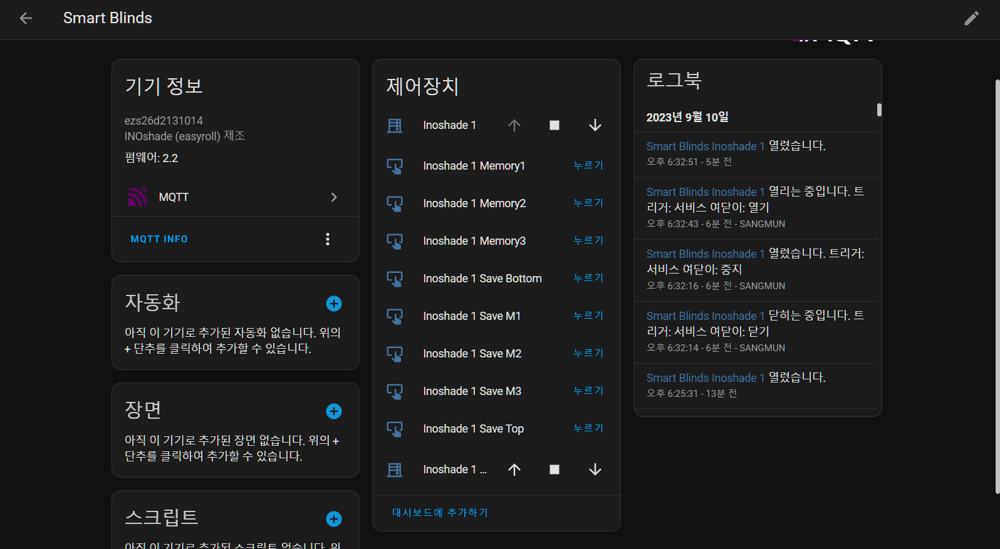

# Home Assistant Add-on: EasyRoll Smart Blind

## Installation

Follow these steps to get the add-on installed on your system:

1. Navigate in your Home Assistant frontend to **Settings** -> **Add-ons** -> **Add-on store**.
2. Find the "EasyRoll Smart Blind" add-on and click it.
3. Click on the "INSTALL" button.

## How to use

The add-on has a couple of options available. To get the add-on running:

1. Start the add-on.
2. Have some patience and wait a couple of minutes.
3. Check the add-on log output to see the result.

MQTT Integration Component Settings:

1. The Integrated Components page should have MQTT and be "Enabled newly added components" when you click [⋮].
2. The "Smart Blinds" instrument is created in the MQTT integration component and all entities are registered.


## Configuration

Add-on configuration:

```yaml
blind:
  - 192.168.1.14
mqtt:
  server: 192.168.1.10
  port: 1883
  username: user
  password: passwd
  require_login: true
reverse_direction: false
require_certificate: false
certfile: fullchain.pem
keyfile: privkey.pem
scan_interval: 900
```

### Option: `blind`

Enter addresses for easy roll blinds you want to connect to Type `- ip address` as many blinds as you want

### Option: `mqtt`

- Fill in the information of the MQTT broker. `server/port` is required and `useranme/password` is filled out if `require_login` is true.
- For ports with ssl authentication, see `certfile`

### Option: `cafile` (optional)

A file containing a root certificate. Place this file in the Home Assistant `ssl` folder.

### Option: `certfile`

A file containing a certificate, including its chain. Place this file in the Home Assistant `ssl` folder.

**Note on `certfile` and `keyfile`**  
- If `certfile` and `keyfile` are _not_ provided
  - Unencrypted connections are possible on the unencrypted ports (default: `1883`, `1884` for websockets)
- If `certfile` and `keyfile` are provided
  - Unencrypted connections are possible on the unencrypted ports (default: `1883`, `1884` for websockets)
  - Encrypted connections are possible on the encrypted ports (default: `8883`, `8884` for websockets) 
     - In that case, the client must trust the server's certificate

### Option: `keyfile`

A file containing the private key. Place this file in the Home Assistant `ssl` folder.

**Note on `certfile` and `keyfile`**  
- If `certfile` and `keyfile` are _not_ provided
  - Unencrypted connections are possible on the unencrypted ports (default: `1883`, `1884` for websockets)
- If `certfile` and `keyfile` are provided
  - Unencrypted connections are possible on the unencrypted ports (default: `1883`, `1884` for websockets)
  - Encrypted connections are possible on the encrypted ports (default: `8883`, `8884` for websockets) 
     - In that case, the client must trust the server's certificate

### Option: `require_certificate`

If set to `false`:
- Client is **not required** to provide a certificate to connect, username/password is enough
- `cafile` option is ignored

If set to `true`:
- Client is **required** to provide its own certificate to connect, username/password is _not_ enough
- A certificate authority (CA) must be provided: `cafile` option
- The client certificate must be signed by the CA provided (`cafile`)

### Option: `reverse_direction`

Change the status of the blind in reverse

Default value: `false`

### Option: `scan_interval` 

Blind query status lookup interval. Gets the blind status every `scan_interval` interval.

Default value: `900`

## Support

Got questions?

You have several options to get them answered:

- The Home Assistant [NAVER Cafe][forum].

In case you've found a bug, please [open an issue on our GitHub][issue].

* If you experience problems after the add-on update, delete the files in the /share/easyroll folder and try restarting the add-on.
* File Editor File Editor (Directories First = true, Enforce Basepath = false) File Editor

[forum]: https://cafe.naver.com/koreassistant
[issue]: https://github.com/harwin1/ha-addons/issues
[repository]: https://github.com/harwin1/ha-addons
